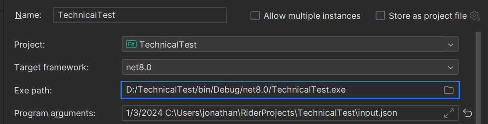

# Input/Output
- The program requires two arguments to be passed when executed: the start date and the full file path of a JSON file containing customer data.

An example customer.json file can be found in "input.json"

- The output will be printed to the console, and a file named "output.json" will be created in the directory where the program is running.

# Code Overview
 - **Program.fs** - Contains the main logic for the program. Given the input, it determines the 90-day range and decides which customers should receive a message when.
 - **Types.fs** - Defines the data types used in the program, including the Customer type and Marketing Preference discriminated union. It also includes logic for parsing JSON data.
 - **InputParser.fs** - Implements the logic for reading user input (start date and file path).
 - **Tests.fs** - Includes simple XUnit tests to ensure the main functions are functioning correctly.
 - **_input.json_** - An example customer data file.

# Assumptions made
- Customer names are assumed to be unique. If a JSON file contains multiple occurrences of a customer name, only the first occurrence will be included in the processing. This ensures that a customer cannot have conflicting marketing preferences (e.g., "Every Day" and "Never").
- Customers with invalid day of the week or date of the month values will be ignored during processing.